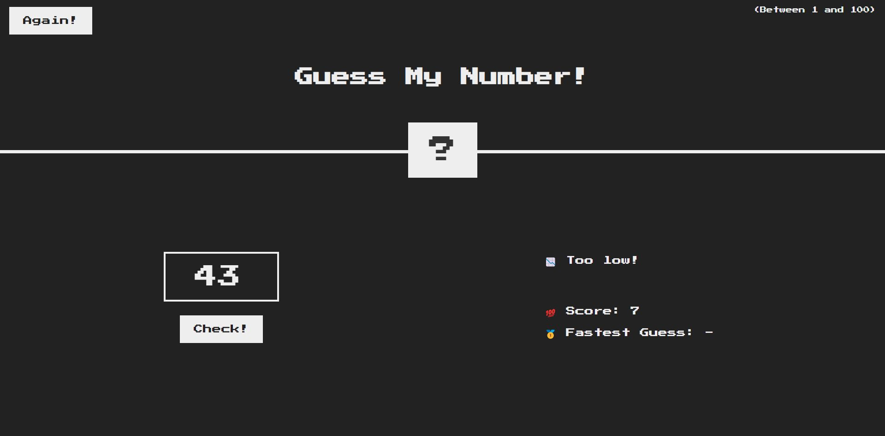
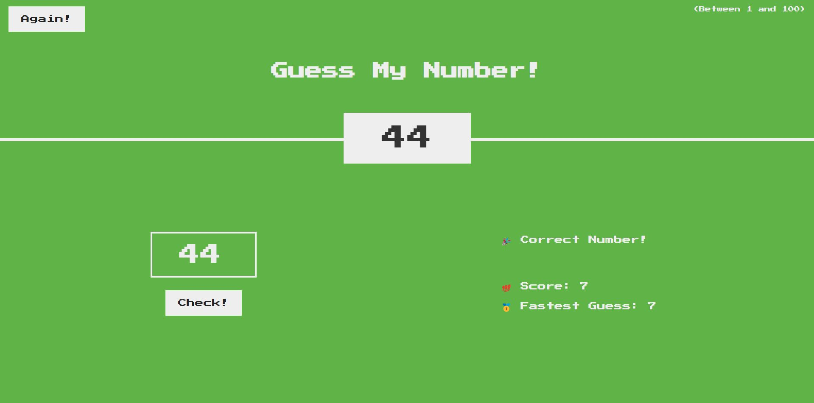

# GuessingGame with JavaScript

Yeah you guessed it right! It is a guess my no. game written in javascript.\
To play the game click here => https://adnan-s-husain.github.io/GuessingGame/

## Instructions to Play
1. When you start the game, a random no. is generated. You have to guess this no.
2. You can type your guesses and check if it is correct, too high or too low.
3. If it is too high, then you have to guess lower and vice versa.
4. Lowest score is the best so try to guess the no. quickly and show off to your friends.

## Here's how it looks-like

## How to Run the project on your Device

In the project directory, you just have to double click index.html file😊.
